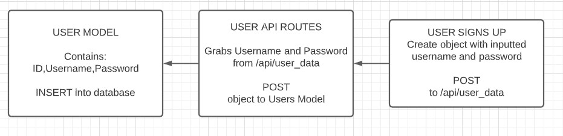
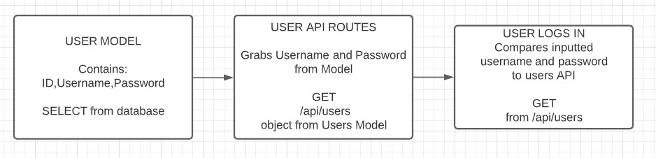
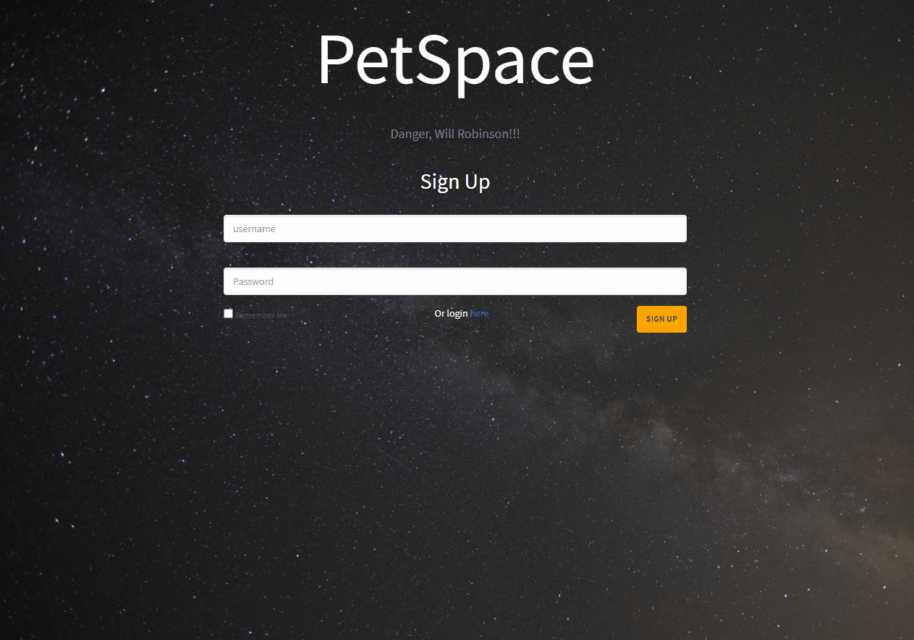
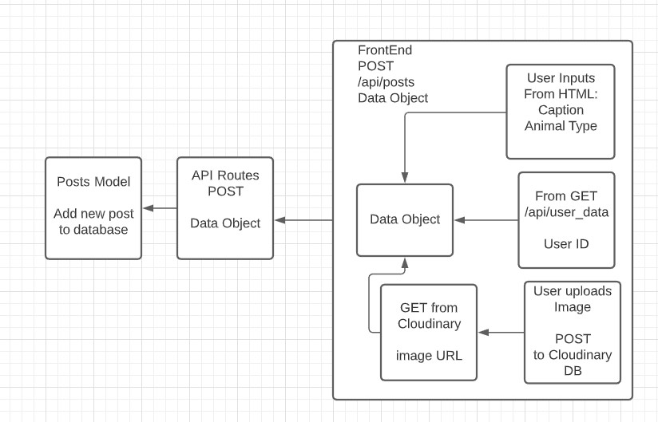
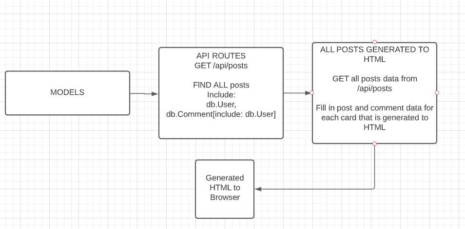
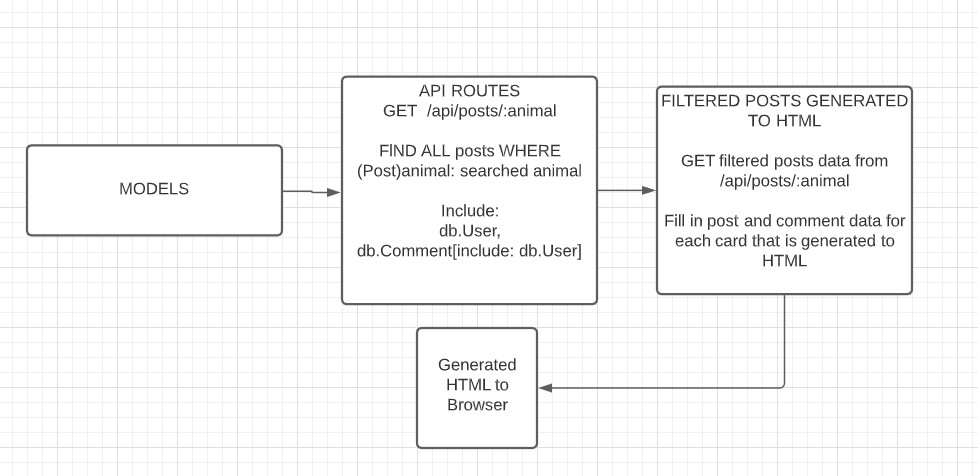
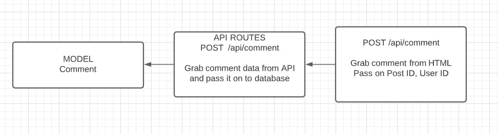
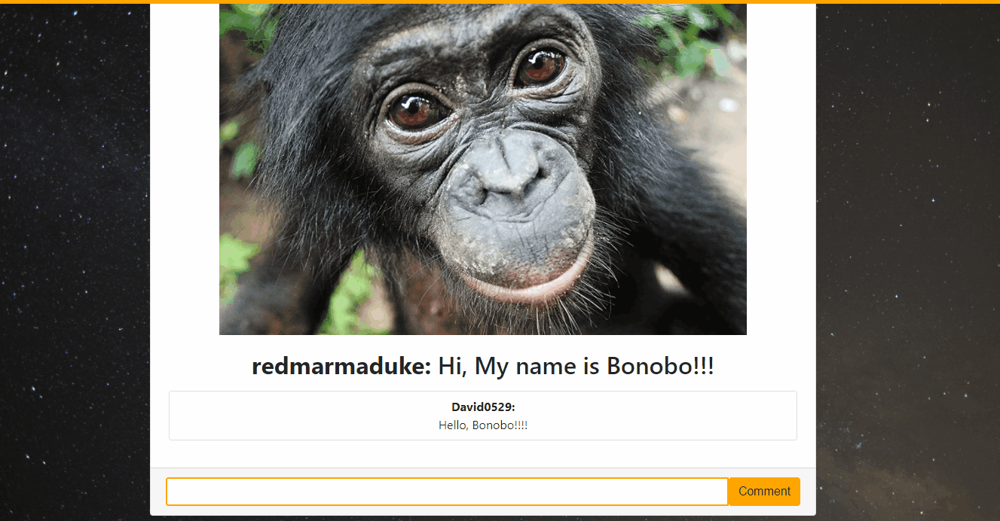

# PetSpace
[](https://www.mit.edu/~amini/LICENSE.md)
<br>
 A global community of users to share and view pictures of pets!
 An entertainment web application for users to scroll through feeds of pet posts. Users can create their own posts of their pets and comment on all posts.

<br>

For a preview with a database hosted through JawsDB click [here.](https://petspace2020.herokuapp.com/) <br> To log in as a guest use `username: guest` and `password: password`.
<br>
<br>
<hr>

 ## Table of Contents:
* [Built With](#Built-With)
    * [Dependencies](#Dependencies)
* [Installation](#Installation)
* [Features](#Features)
* [Models](#Models)
    * [Signup/Login](#SignUp/Login)
    * [Create Posts](#Create-Posts)
    * [Display Posts](#Display-Posts)
    * [Create Comment](#Create-Comment)
* [Deployed Link](#Deployed-Link)
* [Repository Link](#Repository-Link)
* [Authors](#Authors)

<br>
<hr>
  
 ## Built With
* MySQL2
* Express
* JawsDB
* jQuery
* Axios
* Sequelize
* Passport
* bcryptjs
* Cloudinary
* BootStrap
* JavaScript
* HTML/CSS

### Dependencies
* [Express](https://www.npmjs.com/package/express)
* [MySQL2](https://www.npmjs.com/package/mysql2)
* [Sequelize](https://www.npmjs.com/package/sequelize)
* [Passport](https://www.npmjs.com/package/passport)
* [Passport-Local](https://www.npmjs.com/package/passport-local)
* [bcryptjs](https://www.npmjs.com/package/bcryptjs)

<br>
<hr>

## Installation
To install dependencies run:
```
npm install
```
To run locally with node:
```
node server.js
```
It should locally on localhost at port 8080 :

```javaScript
var PORT = process.env.PORT || 8080;
```


To run database locally you must install MySQL2 and create a local server. Make sure your port, user, and password match. To create the compatible tables you must run the schema.sql file in your workbench.
You can include some provided table data by running the seeds.sql in your workbench as well.
Please make sure the following match your personal MySql information in the config.json file, and that the database is set to "petSpace".

```javaScript

"development": {
    "username": "root",
    "password": "password",
    "database": "petSpace",
    "host": "127.0.0.1",
    "port": 3306,
    "dialect": "mysql"
  }

```

## Features
Users can scroll through post feed, create posts, and comment on user's posts.

<br>


<br>
<hr>

## Models Structure
### MODELS
Three tables created: Users, Posts, Comments. <br><br>
User HAS MANY Posts, Comments <br>
Posts BELONGS TO Users <br>
Posts HAS MANY Comments <br>
Comments BELONGS TO Posts, Users


<br>  

### SignUp/Login

<br>

Login/Signup with PetSpace:
As a User, I want to be able to login and Signup with my own username.

Acceptance criteria:
Given I’m a User, when I sign up with a username and password, then I will be logged in with my own personal username.

<br>





<br>

### Create Posts

<br>


Create a post:
As a User, I want to create posts so I can share my pet.

Acceptance criteria:
Given I’m a User, when I click on a create post button, I can input a title, category, and image to show off my pet.


<br>




### Display Posts

<br>


See feeds of  all posts:
As a User, I want to see new posts on the main page.

Acceptance criteria:
Given I’m a User, when I log in to the main page, I will see a list a newly updated feeds for my entertainment.

<br>



<br>
Search by a pet:
As a User, I want to search a pet by category.

Acceptance criteria:
Given I’m a User, when I click the sorting dropdown, a list of pet categories is provided so I can see a specific type of pet. 





<br>

### Create Comment

<br>


Comment on a post:
As a User, I want to comment on posts so I can interact with other users.

Acceptance criteria:
Given I’m a User, when I see a post I like, I am able to leave a comment.


<br>





<br>
<br>

## Deployed Link:
https://petspace2020.herokuapp.com/

## Repository Link:
https://github.com/joshglugatch/PetSpace

<br>

### Authors:
Josh Glugatch  

Portfolio link: https://joshglugatch.github.io/josh-glugatch-portfolio/

[](https://github.com/joshglugatch)
<br>
[](www.linkedin.com/in/joshua-glugatch)

<br>
David Yi  

Portfolio link: https://davidyi0529.github.io/Updated-Portfolio_D/

[](https://github.com/davidyi0529)
<br>
[](http://www.linkedin.com/in/davidyi0529)

<br>
Jefry Romero  

[](https://www.github.com/romerojefry)
<br>
[](https://www.linkedin.com/in/jefry-romero-6125a0160)

<br>
Ernest Wesson  

Portfolio link: https://heem86.github.io/EW-Repsonsive-Site/

[](https://github.com/HEEM86)
<br>
[](https://www.linkedin.com/in/ernest-wesson-b4183b5a/)

<br>
<br>
https://docs.google.com/presentation/d/1Pj8mQpmKvNIhPOUJSjuTV0uO0Te4vFkxO5tv0mAkK7c/edit?usp=sharing


